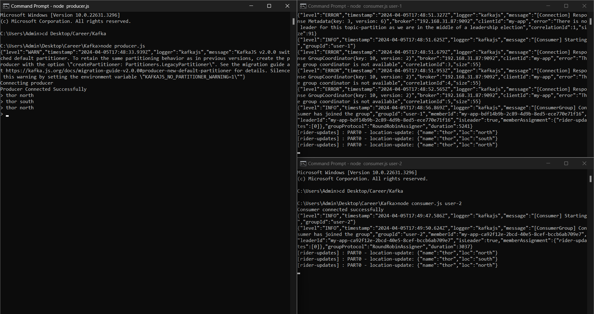

# Project Title

A brief description of what this project does and who it's for

# KAfka - Tutorial repo

## Prerequisite

- Knowledge
- Node.JS : Intermediate level
- Experience with designing distributed systems
Tools
- Node.js: [Download Node.JS](https://nodejs.org/en/download)
- Docker: [Download Docker](https://www.docker.com/products/docker-desktop/)
- VsCode: [Download VsCode](https://code.visualstudio.com/download)

## Commands

1. Start Zookeper Container and expose PORT **2181**.
   ```bash
   docker run -p 2181:2181 zookeeper

2. Start Kafka Container, expose PORT **9092** and setup ENV variables.
    ```bash
    docker run -p 9092:9092 \
    -e KAFKA_ZOOKEEPER_CONNECT=<PRIVATE_IP>:2181 \
    -e KAFKA_ADVERTISED_LISTENERS=PLAINTEXT://<PRIVATE_IP>:9092 \
    -e KAFKA_OFFSETS_TOPIC_REPLICATION_FACTOR=1 \
    confluentinc/cp-kafka

## Code files listing

- admin.js
- client.js
- producer.js
- consumer.js

## Running it locally

- Run Multiple Consumers
   ```bash
    node consumer.js <GROUP_NAME>

- Sample output:

  

> Anyone South

> Anyone North

Happy Note-taking! 📝✨
